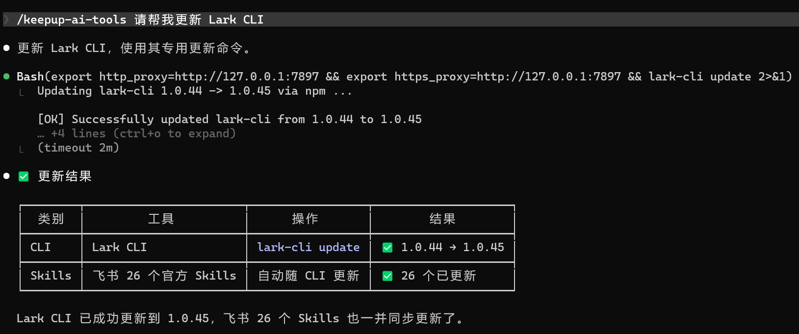

# keepup-ai-tools

**English** | [中文](README_zh.md)

> One-command check & update for all your AI agent CLI tools, Skills, and Plugins.

A cross-agent [Skill](https://code.claude.com/docs/en/skills) that works with **Claude Code, Codex, Hermes**, and any agent supporting the SKILL.md format. Install once via `npx skills add`, available in all your agents.

Auto-discovers everything on your machine — CLI tools via npm/pipx/Homebrew/winget, Agent Skills (npx skills), Claude Code Plugins — checks for updates, and applies them in one shot.

**Auto-discovery, zero config.** No hardcoded tool list. Whatever you have installed, it finds.

## What it detects

| Source | Method | Platform |
|--------|--------|----------|
| npm global packages | `npm list -g` + `npm outdated` | All |
| pipx tools | `pipx list` | All |
| Homebrew formulae | `brew list` | macOS / Linux |
| winget packages | `winget list` | Windows |
| scoop packages | `scoop list` | Windows |
| cargo / go binaries | `cargo install --list` / `go env GOPATH` | All |
| AI CLI tools (ollama, gemini, etc.) | PATH probing via `command -v` | All |
| WSL tools (Hermes, etc.) | `wsl.exe` | Windows |
| Agent Skills | `~/.agents/.skill-lock.json` | All |
| Claude Code Skills | `npx skills check` | All |
| Claude Code Plugins | `~/.claude/plugins/` (git SHA diff) | All |
| Codex / Hermes skills | Directory scan | All |

## Quick start

```bash
# Install from GitHub (recommended)
npx skills add liuqi1024/keepup-ai-tools -g -y

# Or: project-level install for trial
cp -r keepup-ai-tools .claude/skills/
```

<p align="center">
  
</p>

Then in Claude Code, just say:

| Command | What happens |
|---------|-------------|
| "check updates" / "检查更新" | Scans everything, reports what's outdated |
| "update all" / "更新全部" | Lists pending updates, asks confirmation, executes |
| "tool status" / "工具状态" | Quick offline snapshot (no network) |
| "reset config" / "重置配置" | Re-run environment setup (OS, proxy, WSL) |

First run auto-detects your OS, proxy settings, and WSL availability.

## Example output

```
## 🔍 工具链更新检查报告

### CLI 工具
| 工具 | 当前版本 | 最新版本 | 状态 | 更新命令 |
|------|---------|---------|------|---------|
| Claude Code | 2.1.133 | 2.1.140 | 🔺可更新 | `npm update -g @anthropic-ai/claude-code` |
| Codex CLI | 0.134.0 | — | ✅最新 | — |
| Ollama | 0.5.0 | — | ✅最新 | — |

### Agent Skills（按来源分组）
| 来源 | 类型 | Skills 数量 | 状态 | 更新命令 |
|------|------|------------|------|---------|
| user/example-skill | GitHub | 1 | 🔺有变化 | `npx skills add user/example-skill -g -y` |

### Claude Code Plugins
| Plugin | Marketplace | 当前 SHA | 最新 SHA | 状态 |
|--------|-------------|---------|---------|------|
| superpowers | example-marketplace | abc1234 | abc1234 | ✅最新 |

---
> 📊 总计：2 项可更新 | 3 项最新 | 0 项检查失败
> 💡 回复"更新全部"来执行更新
```

## First-time setup

On first run, the skill auto-detects your environment and asks:

1. **Proxy**: Do you need a proxy for GitHub/npm? (common in China mainland)
2. **WSL** (Windows only): Do you want proxy configured for WSL tools?

Settings saved to `~/.handy-tools-update.json`. Delete it to reconfigure.

### WSL proxy note

WSL can't reach `127.0.0.1` on the host. The skill auto-detects the gateway IP:

```bash
wsl.exe -e sh -lc "ip route | grep default | awk '{print \$3}'"
# → 172.x.x.1
```

## Supported tools

These are recognized with specific update commands, but **any tool found by the scanners is reported** — not just these:

| Tool | Install source | Update method |
|------|---------------|---------------|
| `claude` | npm: `@anthropic-ai/claude-code` | `npm update -g` |
| `codex` | npm: `@openai/codex` / winget | `npm update -g` / `winget upgrade` |
| `lark-cli` | npm: `@larksuite/cli` | `lark-cli update` |
| `mo` | npm: `@mowenxd/cli` | `npm update -g` |
| `hermes` | WSL / git | `git pull --ff-only` |
| `aider` | pipx: `aider-chat` | `pipx upgrade` |
| `ollama` | brew / direct | `brew upgrade` |
| `gemini` | npm | `npm update -g` |
| `cursor` | winget / direct | `winget upgrade` |
| `fabric` | go install / pipx | `go install` / `pipx upgrade` |

## Security

- **Never auto-updates silently** — always shows pending changes and waits for confirmation
- **No external dependencies** — only requires `bash` and `node` (for JSON parsing)
- **Network calls are read-only** — `npm outdated`, `git fetch`, `git ls-remote`
- **No credentials collected** — doesn't store or transmit API keys, tokens, or passwords

## File structure

```
keepup-ai-tools/
├── SKILL.md                  # Skill definition (natural language instructions)
├── README.md
└── scripts/
    ├── scan-npm.sh           # npm global packages + outdated check
    ├── scan-wsl.sh           # WSL tool detection (Hermes, etc.)
    ├── scan-skills.sh        # Skills lock file + directory scan
    ├── scan-plugins.sh       # Claude Code Plugins scan
    └── scan-system.sh        # System AI CLI + package managers (brew/winget/cargo/go)
```

## Contributing

Issues and PRs welcome at [github.com/liuqi1024/keepup-ai-tools](https://github.com/liuqi1024/keepup-ai-tools).

## License

MIT
